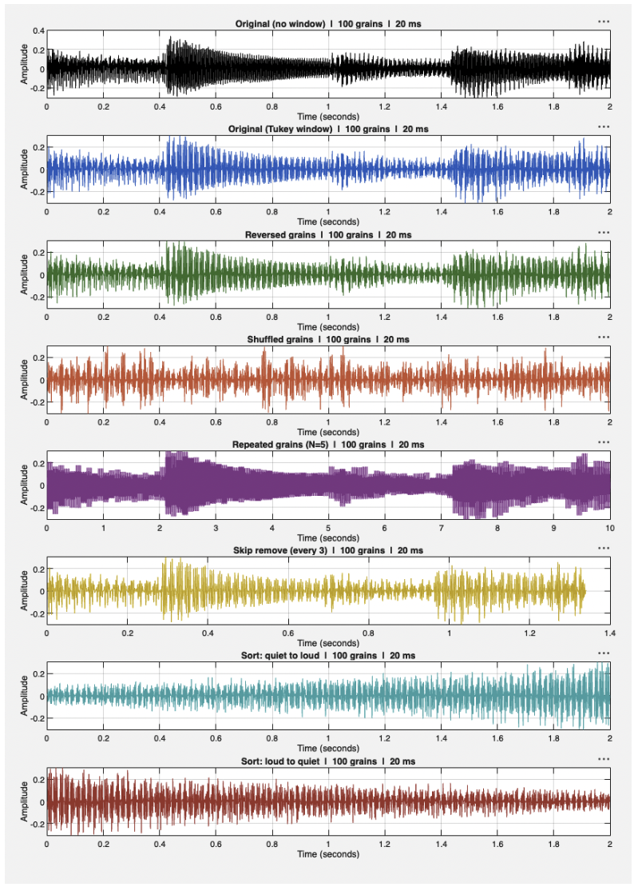

# matlab-granular-synthesis

A MATLAB demonstration of synchronous granular synthesis. An audio file is chopped into grains of a user defined length, windowed, and transformed to show what the technique can do.

## Background

Granular synthesis builds sound from grains: brief microacoustic events, generally between 1 and 100 ms long, each shaped by an amplitude envelope known as a window (Roads). This project focuses on synchronous granular synthesis, where grains are stacked one after another in sequence.

## Transformations

- Reverse each grain
- Shuffle grain order
- Repeat each grain N times (2 to 100), which time stretches the audio without changing pitch
- Skip every Nth grain
- Sort grains by average RMS amplitude, loudest to quietest or the reverse

## Files

- `granularSynthesisMain.m` runs the program, with parameters entered at the command line
- `granularSynthesisReconstruction.m` can be run separately from the main script
- `PLAYBACK.m` plays back the output file (`out.wav`)
- The output WAV files can be imported into a DAW and used as source material for further manipulation.

## Usage

Run `granularSynthesisMain.m` in MATLAB and enter the following when prompted:

- Audio file: the name of the WAV file to process
- Grain size in milliseconds
- Region: a start and end time in seconds (one to two seconds is recommended for a demo)
- Window: None (rectangular), Hann, Hamming or Tukey. For Tukey you also enter an alpha value, where 0 is rectangular and 1 is Hann
- Silence gap: the length in seconds of the silence between each processed section
- Transformations to apply

## Output

- A MATLAB figure with one subplot per section: the original audio, the original with the window applied, then each selected transformation in order
- `out.wav`, a concatenation of all processed sections separated by the silence gap, so each transformation can be heard in sequence

## Notes

Windowing artefacts are clearly audible. A Tukey window with alpha 0.5 fades each grain from zero to full amplitude and back, so stacked grains leave near silence between them and produce a stuttering effect. PaulStretch, which uses a similar chop and repeat approach, produces fewer artefacts.

## Requirements

- MATLAB developed in MATLAB Online, 26.2.0.3386108 (R2026b)
- Signal Processing Toolbox
- Keep all the .m files in the same folder, or on the MATLAB path.

## Screenshot

